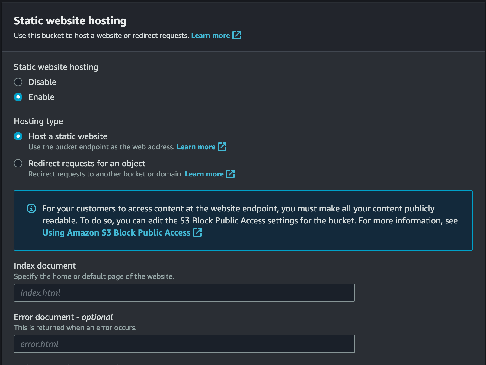
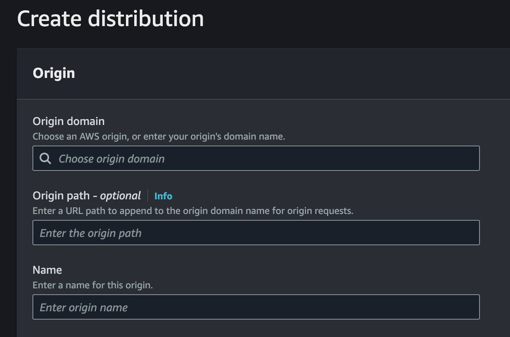
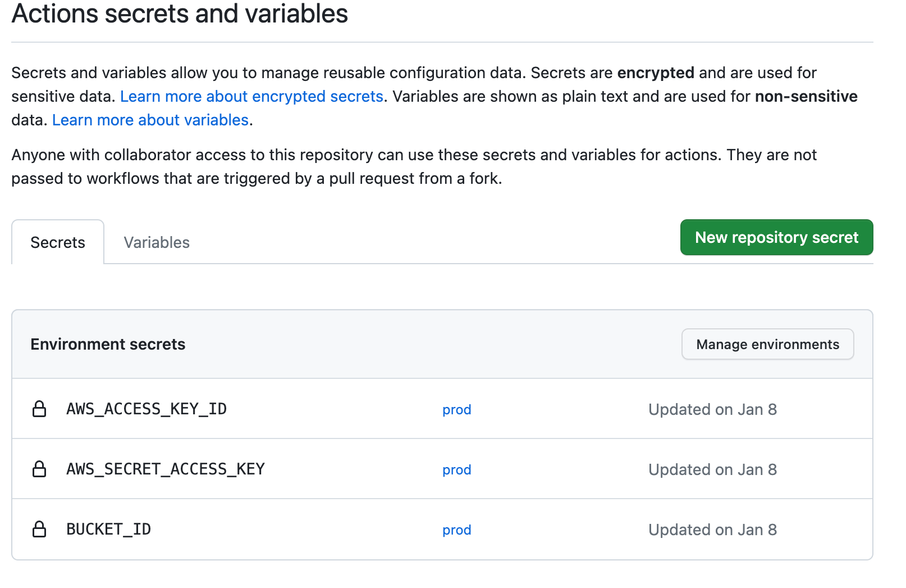

Nowadays, there are numerous ways to blog. You can use the omnipresent platforms like **WordPress**, **Blogger**, or newer, more stylish platforms like **Medium**, **dev.to**, or **Substack**.

However, there are ways to do things a bit more old-school. Here, we're going to explain how to create a blog from scratch using a framework from [Jamstack](https://jamstack.org/). In this case, we'll learn how to create and launch a blog online, using [Hugo](https://gohugo.io/), AWS, and [Github Actions](https://github.com/features/actions).

<!--truncate-->

## The framework
We have selected Hugo, but there are a lot of options, you can check them all here [Jamstack site generators](https://jamstack.org/generators/)
- Jekyll would be one of oldest static page generators around. It works well and it has been behind Github for a long time.
- Next.js, from Vercel, great framework, but maybe for a blog is too much
- Hugo, quite similar to Jekyll but in Go, fast, easy to use and customizable, really my choice

### Hugo
We can talk how to setup the blog but to be honest their documentation is great, you can check their [quick start guide](https://gohugo.io/getting-started/quick-start/)

:::tip
Use always `hugo server -D` while creating your content and remember to set the blogpost in draft while writing them
:::

## How to deploy
Once you have a working repository with [Hugo](https://gohugo.io/), we will need to modify the following file `config.toml`.
In this case we are going to build the repository with an Github action and push it to AWS S3.

## Create a S3 bucket
Navigate to the [S3 console in AWS](https://s3.console.aws.amazon.com/s3/home?region=eu-west-1).
1. Create bucket
2. Choose name (It has to be unique)
3. Choose the region
4. The default options are ok for now
    - Block all public access - ON
    - ACLs disabled (recommended)

## Let's open it to the world
From your local, build `hugo --minify` and then *manually* you can upload everything to S3. (We will do it automatically soon)
### Option 1 - Public S3
Go to the `Properties` section of your bucket and scroll to the bottom to the `Static website hosting` and click `Edit`. You will see the following

In this case `index.html` and `404.html` will be your chooices for index and error page. Save it.
AWS will provide a url like ```http://<my-bucket>.s3-website-eu-west-1.amazonaws.com```. Click there and what you will see is a `403 Forbidden - AccessDenied`.
What's happening? When we created the blog, do you remember this option **Block all public access**? Now it will be time to clear that option, so we open the bucket content to the world. 
So under `Pemissions` tab, click `Edit` on the `Block public access` and switch off. Confirm it. But still we are one step away of having the website public. Again under Permissions you need to Edit the bucket policy and add the following
```json
{
    "Version": "2012-10-17",
    "Statement": [
        {
            "Sid": "PublicReadGetObject",
            "Effect": "Allow",
            "Principal": "*",
            "Action": [
                "s3:GetObject"
            ],
            "Resource": [
                "arn:aws:s3:::<my-bucket>/*"
            ]
        }
    ]
}
```
Now, your website is accessible at ```http://<my-bucket>.s3-website-eu-west-1.amazonaws.com```.
If you have a domain and you want to use it, you can add a CNAME pointing to that URL.
However, S3 static pages do not support HTTPS. If you want to add HTTPS, you need to proceed to the next option - CloudFront.

### Option 2 - Cloudfront
If you did Option 1, now it's time to undo everything. Remove the policy, block all public access and remove the Static website option.
But first, [what is Cloudfront?](https://docs.aws.amazon.com/AmazonCloudFront/latest/DeveloperGuide/Introduction.html)
>Amazon CloudFront is a web service that speeds up distribution of your static and dynamic web content, such as .html, .css, .js, and image files, to your users. 
So with cloudfront we can serve our own files from an S3 bucket! So let's create a cloudfront distribution.

#### Cloudfront distribution
Proceed to [AWS cloudfront console](https://us-east-1.console.aws.amazon.com/cloudfront/v3/home?region=eu-west-1#/distributions) and `Create distribution`. In the next step

Select your bucket as origin, add a name or leave the default. Next step is to set the `Origin access control settings (recommended)` and put in the `Origin access control` your bucket.
You will see this

About HTTP or HTTPS, for now leave both, we will change that later when we have the certificate ready. With `GET` and `HEAD` should be ok. Disable WAF and in the price class section, I did select North America and Europe but choose what fits your needs. You will need to add `Default root object - optional` your `index.html`. Otherwise you will get and `Access Denied` if you go for the root (`/`) of your cloudfront distribution.

CNAME and HTTPS will do it later, don't worry for now. Hit for the creation, since it will take a couple minutes for AWS to create the distribution
#### S3 Permissions
Meanwhile AWS is deploying, from the banner you see after the creation of the distribution, you can copy the policy and a link to the permissions page of the S3 bucket. The policy will look something like this.
```json
{
    "Version": "2008-10-17",
    "Id": "PolicyForCloudFrontPrivateContent",
    "Statement": [
        {
            "Sid": "AllowCloudFrontServicePrincipal",
            "Effect": "Allow",
            "Principal": {
                "Service": "cloudfront.amazonaws.com"
            },
            "Action": "s3:GetObject",
            "Resource": "arn:aws:s3:::<my-bucket>/*",
            "Condition": {
                "StringEquals": {
                    "AWS:SourceArn": "<my cloudfront arn>"
                }
            }
        }
    ]
}
```

Now, you can use your ```https://<my-distribution-id>.cloudfront.net/```
#### Custom domain
Now, we need to navigate to [Route 53](https://us-east-1.console.aws.amazon.com/route53/v2/home#Dashboard), there you will need to create a `Hosted zone` with your domain, a public one. That will create your zone and will add a couple of entries: nameservers (NS) and a SOA.
You can add a `CNAME` record to the ```https://<my-distribution-id>.cloudfront.net/```. However, that won't work with the HTTPS, since you will need to attach a **trusted certificate**.
#### HTTPS
Next step, requesting those certificates, in order to to that go to [AWS Certificate Manager (ACM)](https://us-east-1.console.aws.amazon.com/acm/home?region=us-east-1#/certificates/list).
Request a public certificate, click Next, once in the following page add your domain `mycooldomain.com` and `*.mycooldomain.com`, if you can choose the DNS validation otherwise email will be enough. Click `Request` and wait (it will take time)
Meanwhile, the Certifice is in a Pending state, go inside it will tell you to create some Route 53 records, go for them!
Once they are Issued, you can select the certificate from the Cloudfront distribution. With that you can navigate to `https://mycooldomain.com` and your certificate will in place.

## IAM and User
Navigate to IAM, Users and `Add user`. We don't need to use Identity Center, we just want programatic access. Auto generated the password and don't give the user any policy.
Create the user, next select the user and Add permissions and create an inline policy
```json
{
    "Version": "2012-10-17",
    "Statement": [
        {
            "Effect": "Allow",
            "Action": "s3:ListBucket",
            "Resource": "arn:aws:s3:::<my-bucket>"
        },
        {
            "Effect": "Allow",
            "Action": [
                "s3:PutObject",
                "s3:DeleteObject"
            ],
            "Resource": "arn:aws:s3:::<my-bucket>/*"
        }
    ]
}
```
Navigate to the `Security credentials`, scroll to `Access keys` and hit create. Select the `CLI` usage, next and create. Copy the `Access key` and `Secret access key` or download the .csv. You will need them later.

## The Github Action
Github is a great option for storing your Git projects, another option is GitLab and their CD/CI.
But those github actions are great, easy to use and you have some free (2K) minutes.
In order to make it work, you will need to create the following file `.github/workflows/workflow.yml`
```yaml
on:
  push:
    brancehs: [main] # <- Run only for the main branch

jobs:
  build:
    runs-on: ubuntu-latest
    environment: 
      name: prod # <- The environment!
    timeout-minutes: 5 # <- If it fails we put some timeout so we don't waste the free quota
    steps:
      - name: Check out main
        uses: actions/checkout@v3
        with:
          submodules: true # <- We need to checkout plus the submodules (for the theme)

      - name: Configure AWS Credentials # <- We need some credendentials to push to S3
        uses: aws-actions/configure-aws-credentials@v1
        with:
          aws-access-key-id: ${{ secrets.AWS_ACCESS_KEY_ID }}
          aws-secret-access-key: ${{ secrets.AWS_SECRET_ACCESS_KEY }}
          aws-region: eu-west-1

      - name: Install Hugo
        uses: peaceiris/actions-hugo@v2
        with:
          hugo-version: '0.109.0' # <- Install a determined version of Hugo 
          extended: true

      - name: Build
        run: hugo --minify # <- Build (with minify option)
      
      - name: Deploy
        run: hugo deploy # <- Deploy
```
Navigate to `Settings`, then to `Secrets and Variables`. Now, you can add your secrets and specify an environment; in this case, I used `prod`. However, you can add different environments. For instance, if you want each PR to push your build to a different environment, you can achieve this by setting keys for different environments.



**Voilà**! Your blog is ready to be deployed automatically; you just need to start writing content!

PS: About the cost, some parts will be for free (at least for 12 months) like AWS S3. Cloudfront should be free if you are under 10M requests/month. So in general it shouldn't be much.