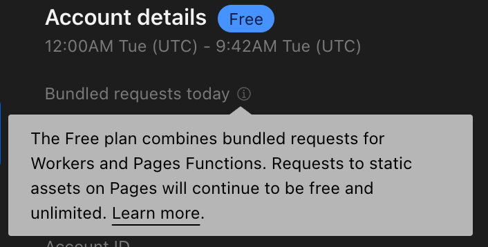

In a previous [blog post](../2023-01-05-create-blog-hard-way/index.md), we talked on how to create a blog and deploy it using Github Actions and several services of AWS (S3, Cloudfront, Route 53, IAM). While you can get a lot of practice doing it yourself, there are some easy ways to deploy a blog (or almost anything).

<!-- truncate -->

## AWS Amplify
In Amazon's cloud, there are several options to [deploy a web server, static page, or whatever](https://aws.amazon.com/websites/).
For our use case, we can utilize [AWS Amplify](https://aws.amazon.com/amplify/). Navigate to the [Amplify console](https://eu-west-1.console.aws.amazon.com/amplify/home?region=eu-west-1#/) and simply get started with `Amplify Hosting`. Select a code repository and authorize the service. Add a repository branch, in this case, `main`. Next, AWS will attempt to auto-detect your repository. If successful, it will provide all the necessary steps to build your project. If those steps are correct, or if you want to edit something, make the necessary adjustments. Otherwise, click `Next` and then `Save and deploy`. AWS will work its magic, deploy your project, and provide you with a URL.
You can add a CNAME record to that URL so you can access your page using your domain.

Remember with Amplify, you may need to pay some euros/dollars at the end of the month.

## Cloudfare
Another option is Cloudflare. Historically, Cloudflare has been associated with networking and DDoS protection, but recently, they've shifted their focus towards being more than just a network provider. They offer features like Pages, Workers, R2 (similar to S3 storage), and Domains. Compared to AWS, it's still smaller, but it's growing and offers what we need — and for **free**!
So visit [Cloudfare](https://www.cloudflare.com/) and register. Go to **Workers & Pages**, Create an application and then **Pages**. Now, the steps are quite similar to those of AWS Amplify. Connect to Git, you can select your GitHub or GitLab account, from there select your repository and Begin Setup.
Select Name, your branch and most important the `Framework preset` and **Save and Deploy**. It will create a page `your-project.pages.dev`
After that, you can add a Custom domain to your recently new page. The best thing is **Free** for static pages.

## Vercel
Vercel is another great option. They are deeply involved in the development of the frontend community and are the creators of the [Next.js framework](https://nextjs.org/), plus they are developing Vercel
> Vercel's frontend cloud gives developers the frameworks, workflows, and infrastructure to build a faster, more personalized Web.

So let's start, navigate to [Vercel](https://vercel.com) and login with your Git provider or email. Select your repository, your branch and then most probably it will detect the framework and then **Deploy**. And that's it! you will have your `your-project.vercel.app`. Again from there you can add a custom domain and again it's **Free**.

As you can see there are other options than AWS for your projects (small and not that small). Enjoy!
